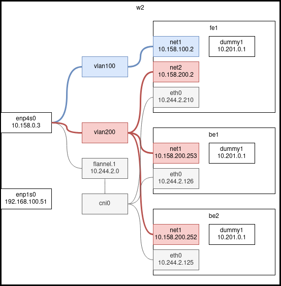
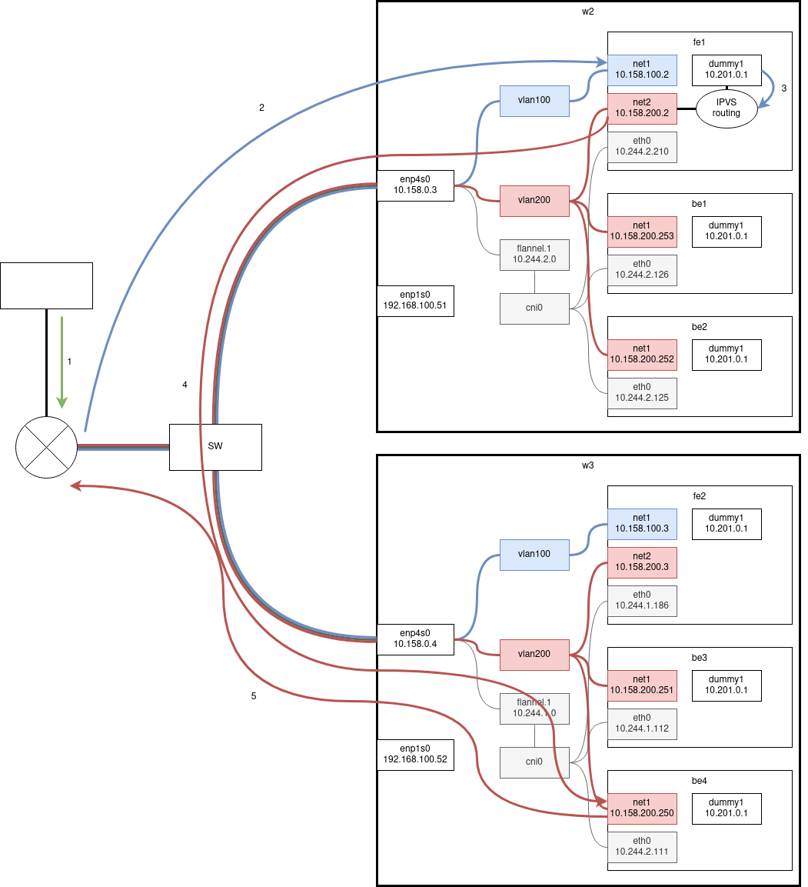

## Hálózat setup a hosztokon

Az alábbi ábrán látható egy worker node hálózatának felépítése. Ebben a példában a w2-es worker node hálózatának felépítése látható.



Az enp4s0 interfészhez tartozik a klaszter belső forgalma, az enp1s0 interfészhez pedig a management hálózat. A feladat szempontjából a management interfész nem érdekes.

A klaszter belső forgalma három hálózaton zajlik, ezért három interfészen oszlik meg. A szürkével jelölt részek a podok közötti hálózat elemeit tartalmazzák, a feladat szempontjából ez nem lényeges. A kékkel jelölt részek egy vlan hálózatot jelölnek, ami a 100-as címkével lett ellátva. Ezen a hálózaton keresztül érkeznek be az üzenetek a routerről a frontend podokba.
A pirossal jelölt részek a frontendek és a backendek közötti vlan hálózatot jelölik. Ezen a hálózaton keresztül küldenek kéréseket a frontendek a backendek felé.

Az alábbi netplan konfigurációval hoztam létre a vlan interfészeket:

```yaml
network:
  version: 2
  renderer: networkd
  ethernets:
    enp1s0:
      dhcp4: yes
    enp4s0:
      addresses: [10.158.0.3/16]
      gateway4: 10.158.0.254
      nameservers:
        addresses: [8.8.8.8, 8.8.4.4]
  vlans:
    vlan100:
      id: 100
      link: enp4s0
    vlan200:
      id: 200
      link: enp4s0
```

A podok közötti hálózat létrehozásához a flannelt használtam, ezt a `kubectl apply -f https://raw.githubusercontent.com/coreos/flannel/master/Documentation/kube-flannel.yml` paranccsal telepítettem. A telepítésnél nekem hibás flannel konfigurációt töltött le, ezért egy másik branch-et kellett használnom.

Hogy további interfészeket tudjak használni a podokban, multust használtam. Ezt a repó letöltése után a `$ cat ./deployments/multus-daemonset-thick-plugin.yml | kubectl apply -f -` paranccsal tudtam megtenni.

Ahhoz hogy a multus segítségével a podon belüli interfészeket a hoszton lévő interfészekkel össze lehessen kötni `networkattachmentdefinition-ket` kell létrehozni kubernetesen belül. Az alábbi konfigurációban a 100-as vlan interfészhez definiáltam `networkattachmentdefinition-t`. Mivel a frontend konténerek net1 interfészének fizikai interfészként kell látszania, ezért a hozzárendelés macvlan módban van megadva. Hogy a többi hálózat is elérhető legyen a 100-as címkéjű vlan hálózatból, ezért ezeknek a hálózatoknak meg van adva a routeren a vlan hálózat gateway-e.

```yaml
apiVersion: "k8s.cni.cncf.io/v1"
kind: NetworkAttachmentDefinition
metadata:
  name: macvlan100
spec: 
  config: '{
      "cniVersion": "0.3.1",
      "plugins": [
        {
          "type": "macvlan",
          "capabilities": { "ips": true },
          "master": "vlan100",
          "mode": "bridge",
          "ipam": { 
            "type": "static",
            "routes": [
              {
                "dst": "0.0.0.0/0",
                "gw": "10.158.100.254"
              },
              {
                "dst": "192.168.100.0/24",
                "gw": "10.158.100.254"
              },
              {
                "dst": "10.158.0.0/16",
                "gw": "10.158.100.254"
              }
            ] 
          }
        }, {
          "capabilities": { "mac": true },
          "type": "tuning"
        }
      ]
    }'
```

A konténereken definiálni kell az extra vlan-okhoz tartozó interfészeket. Az alábbi konfigurációban egy frontend pod konfigurációja látható. A 100-as vlan-hoz tartozó interfészéhez meg kell adni, hogy melyik hozzárendelést (networkattachmentdefinition-t) használja, az interfész ip-címét, mac-címét és gateway-ét és default route-ját. A 200-as vlan-hoz csak az ip-t és mac-címet kell megadni.

```yaml
apiVersion: v1
kind: Pod
metadata:
  name: fe1
  annotations:
    k8s.v1.cni.cncf.io/networks: '[
            { "name": "macvlan100",
              "ips": [ "10.158.100.2/24" ],
              "mac": "c2:b0:57:49:47:f1",
              "gateway": [ "10.158.100.254" ],
              "default-route": ["10.158.100.254" ]
            },
            { "name": "macvlan200",
              "ips": [ "10.158.200.2/24" ],
              "mac": "c2:b0:57:49:47:f2"
            }
            ]'
spec:
  nodeName: w2
  hostAliases:
  - ip: "10.158.200.253"
    hostnames:
    - "hello"
  containers:
  - name: teszt
    image: remenyi/myubuntu:latest
    imagePullPolicy: Always
    ports:
    - containerPort: 80

    securityContext:
      capabilities:
        add:
          - ALL
      privileged: true
```

## Egy kérés útja

Az alábbi ábrán látható egy kérés útja.



Egy lekérdezés az alábbiak szerint történik:

1. A kliens küld egy kérést a 10.201.0.1 címre
2. A router úgy van felkonfigurálva, hogy ECMP-vel a frontendek felé küldje a 10.201.0.1-es címekre beérkező üzeneteket.
3. A csomag megérkezik a frontend vlan 100-as interfészére, azonban mivel a csomag célcíme nem egyezik meg az interfész címével, ezért eldobná. De mivel a dummy1 interfész címe megegyezik a célcímmel, ezért nem dobja el, hanem az ipvs számára továbbítja. Ehhez az alábbi beállításokat kell elvégezni a frontendeken:

```bash
#!/bin/bash

VIP=10.201.0.1
MASK=24

echo `hostname`

ip link add dummy1 type dummy
ip a add $VIP/$MASK dev dummy1

ipvsadm -A -t $VIP:80 -s mh
for i in {248..253}
do
	ipvsadm -a -t 10.201.0.1:80 -r 10.200.0.$i
done
```

4. Az ipvs a maglev hash algoritmus szerint fogja kiválasztani azt a backendet, ahova a csomagot továbbítja majd. Mivel a célcím ugyanúgy 10.201.0.1 lesz, ezért a backendeken is be kell állítani egy dummy interfészt ezzel a címmel. Ezt hasonlóan kell megtenni, mint a backendeken. Ezután a válaszokat egyből a router felé szeretnénk irányítani. Ehhez a backend podokon a vlan 200-as interfész default route-ját a router címére kell beállítani.

```yaml
apiVersion: v1
kind: Pod
metadata:
  name: be1
  annotations:
    k8s.v1.cni.cncf.io/networks: '[
            { "name": "macvlan200",
              "ips": [ "10.158.200.253/24" ],
              "mac": "c2:b0:57:49:47:aa",
              "gateway": [ "10.158.200.254" ],
              "default-route": ["10.158.200.254" ]
            }]'
spec:
  nodeName: w2
  containers:
    - name: be1
      image: "remenyi/hello:latest"
      imagePullPolicy: Always
      ports:
        - name: http
          containerPort: 80
      env:
        - name: MY_NODE_NAME
          valueFrom:
            fieldRef:
              fieldPath: spec.nodeName
        - name: MY_POD_NAME
          valueFrom:
            fieldRef:
              fieldPath: metadata.name
        - name: MY_POD_NAMESPACE
          valueFrom:
            fieldRef:
              fieldPath: metadata.namespace
        - name: MY_POD_IP
          valueFrom:
            fieldRef:
              fieldPath: status.podIP 
      securityContext:
        capabilities:
          add:
            - NET_ADMIN
```

Probléma, hogy az ARP kéréseknél a dummy interfészek címei azonosak, így a router és a frontendek ARP táblájába olyan bejegyzések kerülhetnek, amelyben egyforma ip-címekhez más-más mac-cím tartozik. Ennek megoldására a frontendtől érkező ARP üzeneteket eldobja, a router felé menő ARP üzeneteknek pedig kicseréli a source címét a vlan interfészének címére.

```bash
arptables -F
arptables -A INPUT -d $VIP -j DROP  #eldobja a frontendtől érkező üzeneteket
arptables -A OUTPUT -s $VIP -j mangle --mangle-ip-s $RIP #kicseréli a router felé menő csomagok forráscímét a vlan interfész címére
```